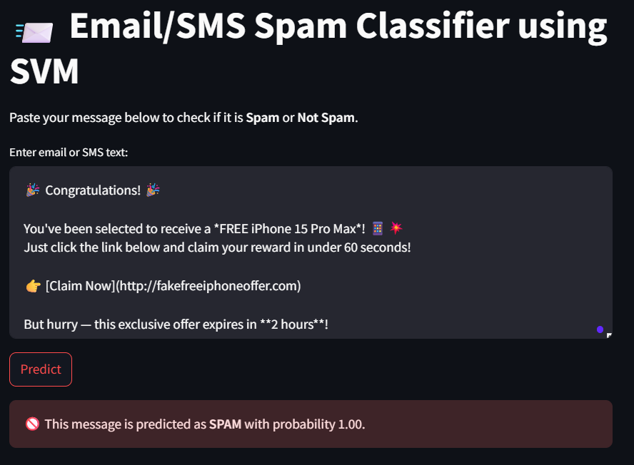

# 📨 Email/SMS Spam Classifier using SVM
A clean **end-to-end ML pipeline project** that classifies email/SMS messages as **Spam or Not Spam** using **Support Vector Machine (SVM)**, featuring:

✅ Data Collection & EDA  
✅ Data Preprocessing using Pipelines  
✅ Model Training & Hyperparameter Tuning  
✅ Evaluation (Confusion Matrix, ROC Curve)  
✅ Deployment with Streamlit

---

## 📌 Problem Statement

**Goal:** Classify email/SMS messages as Spam or Not Spam to automate spam filtering and improve productivity.

- **Type:** Binary Classification
- **Metric:** Accuracy, Precision, Recall, F1 Score, ROC-AUC

---

## 🛠️ Tech Stack

- Python, Pandas, scikit-learn
- SVM with `Pipeline` and `GridSearchCV`
- Streamlit for deployment

---

